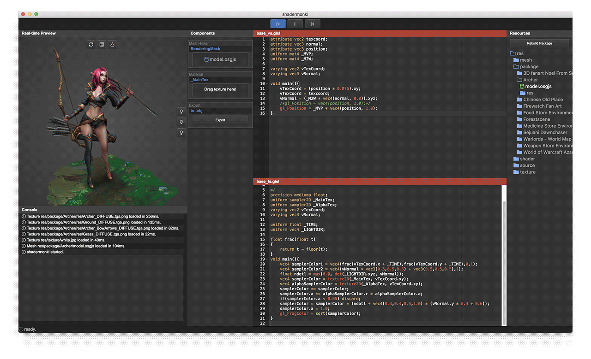

electron-shadermonki
---

[](https://travis-ci.org/gameknife/electron-shadermonki)



a research [rendermonkey](http://developer.amd.com/tools-and-sdks/archive/games-cgi/rendermonkey-toolsuite/) like app based on [electron](https://github.com/electron/electron)

### Startup

* install [node.js](https://nodejs.org)
* update [npm](https://www.npmjs.com) to latest
```
npm install npm@latest -g 
```
* install [cnpm](https://npm.taobao.org/) if ur under gfw
```
npm install -g cnpm --registry=https://registry.npm.taobao.org
```
* install dependency
```
cnpm install
```
* start running
```
npm start
```

### Usage

* edit vs & fs shader file
* press Ctrl + S || Command + S to save change, preview will change at realtime.

### Future Task

1. binary fbx mesh loader
1. resource management
1. unity3d like gameobject & component system
1. real-time shadow & lightmap support
1. deferred shading chain & ssao

### Thanks to

* [ACE](https://github.com/ajaxorg/ace)
* [glcubic.js](https://github.com/doxas/glcubic.js)
* [three.js](https://github.com/mrdoob/three.js)
